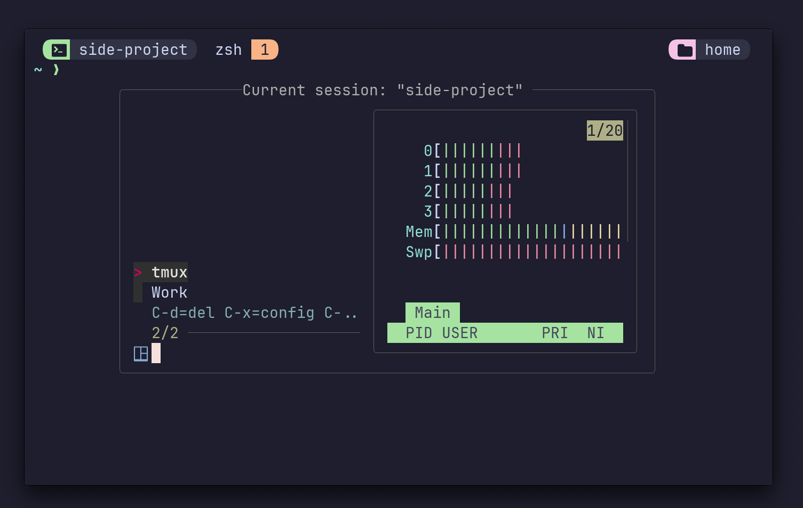

# Tmux SessionX
A fuzzy Tmux session manager with preview capabilities, deleting, renaming and more!




## Prerequisits 🛠️
- [tpm](https://github.com/tmux-plugins/tpm)
- [fzf](https://github.com/junegunn/fzf) (specifically [fzf-tmux](https://github.com/junegunn/fzf#fzf-tmux-script))
- [bat](https://github.com/sharkdp/bat)


## Install 💻
Add this to your `.tmux.conf` and run `Ctrl-I` for TPM to install the plugin.
```conf
set -g @plugin 'omerxx/tmux-sessionx'
```

## Configure ⚙️
The default binding for this plugin is `<prefix>+O`
You can change it by adding this line with your desired key:
```bash
# I recommend using `o` if not already in use, for least key strokes when launching
set -g @sessionx-bind '<mykey>'
```
`C-x` is customizeable as well, by default it indexes `$HOME/.config`, but this can be changed by adding this config line:
```bash
# e.g. set -g @sessionx-x-path '~/dotfiles'
set -g @sessionx-x-path '<some-path>'
```

### Additional configuration options:
```bash
# A comma delimited absolute-paths list of custom paths 
# always visible in results and ready to create a session from 
set -g @sessionx-custom-paths '/Users/me/projects,/Users/me/second-brain'

# By default, the current session will not be shown on first view
# This is to support quick switch of sessions
# Only after other actions (e.g. rename) will the current session appear
# Setting this option to 'false' changes this default behavior
set -g @sessionx-filter-current 'false' 

# Window mode can be turned on so that the default layout
# Has all the windows listed rather than sessions only
set -g @sessionx-window-mode 'on' 
```

## Working with SessionX 👷
Launching the plugin pops up an fzf-tmux "popup" with fizzy search over existing session (-current session).
If you insert a non-existing name and hit enter, a new session with that name will be created.
- `backspace` will delete the selected session
- `C-u` scroll preview up
- `C-d` scroll preview down
- `C-r` will launch a `read` prompt to rename a session within the list
- `C-w` will reload the list with all the available *windows* and their preview
- `C-x` will fuzzy read `~/.config` or a configureable path of your choice (with `@session-x-path`)
- `?` toggles the preview pane


## WARNING ⚠️
This was only tested on one, macOs machine.
It is also not designed to use outside Tmux and is tailored to fit *my* needs.
That said, please feel free to open issues with bugs / additions you'd like to see.


## Thanks ❤️
Inspired by these:
- https://github.com/joshmedeski/t-smart-tmux-session-manager
- https://github.com/ThePrimeagen/.dotfiles/blob/master/bin/.local/scripts/tmux-sessionizer
- https://crates.io/crates/tmux-sessionizer
- https://github.com/petobens/dotfiles/commit/c21c306660142d93d283186210ad9d301a2f5186
