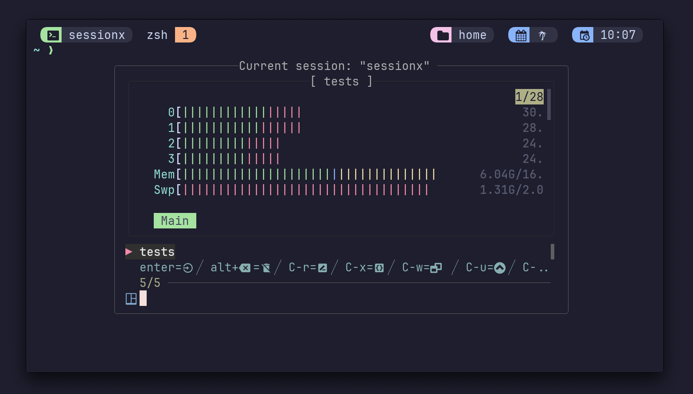

# Tmux SessionX

A fuzzy Tmux session manager with preview capabilities, deleting, renaming and more!



## Prerequisits 🛠️

- [tpm](https://github.com/tmux-plugins/tpm)
- [fzf](https://github.com/junegunn/fzf)
- [fzf-tmux](https://github.com/junegunn/fzf#fzf-tmux-script)
- [bat](https://github.com/sharkdp/bat)
- Optional: [zoxide](https://github.com/ajeetdsouza/zoxide)

## Install 💻

Add this to your `.tmux.conf` and run `Ctrl-I` for TPM to install the plugin.

```conf
set -g @plugin 'omerxx/tmux-sessionx'
```

## Configure ⚙️

The default binding for this plugin is `<prefix>+O`
You can change it by adding this line with your desired key:

```bash
# I recommend using `o` if not already in use, for least key strokes when launching
set -g @sessionx-bind '<mykey>'
```

### Additional configuration options:

```bash
# By default, tmux `<prefix>` key needs to pressed before `<mykey>` to launch
# sessionx. In case you just want to bind '<mykey>' without the tmux '<prefix>'
# add the following line to turn the prefix off. This option is set to
# on by defaut.
set -g @sessionx-prefix off

# `C-x` is customizeable, by default it indexes directories in `$HOME/.config`,
# but this can be changed by adding the config below.
# e.g. set -g @sessionx-x-path '~/dotfiles'
set -g @sessionx-x-path '<some-path>'

# A comma delimited absolute-paths list of custom paths
# always visible in results and ready to create a session from.
# Tip: if you're using zoxide mode, there's a good chance this is redundant
set -g @sessionx-custom-paths '/Users/me/projects,/Users/me/second-brain'

# A boolean flag, if set to true, will also display subdirectories
# under the aforementioned custom paths, e.g. /Users/me/projects/tmux-sessionx
set -g @sessionx-custom-paths-subdirectories 'false'

# Uses `fzf --tmux` instead of the `fzf-tmux` script (requires fzf >= 0.53).
set -g @sessionx-fzf-builtin-tmux 'on'

# By default, the current session will not be shown on first view
# This is to support quick switch of sessions
# Only after other actions (e.g. rename) will the current session appear
# Setting this option to 'false' changes this default behavior
set -g @sessionx-filter-current 'false'

# Window mode can be turned on so that the default layout
# Has all the windows listed rather than sessions only
set -g @sessionx-window-mode 'on'

# Tree mode can be enabled which means that instead of a preview,
# a hierarchy of sessions and windows will be shown
set -g @sessionx-tree-mode 'on'

# Preview location and screenspace can be adjusted with these
# Reminder: it can be toggeled on/off with `?`
set -g @sessionx-preview-location 'right'
set -g @sessionx-preview-ratio '55%'

# The preview can also be disabled altogether
set -g @sessionx-preview-enabled 'false'

# Change window dimensions
set -g @sessionx-window-height '90%'
set -g @sessionx-window-width '75%'

# If you want change the layout to top you can set
set -g @sessionx-layout 'reverse'

# If you want to change the prompt, the space is nedded to not overlap the icon
set -g @sessionx-prompt " "

# If you want to change the pointer
set -g @sessionx-pointer "▶ "

# Customize `ls` command to display your directories nicely (default: `ls`)
# Can be used with `exa`, `lsd`, or other command of your choice to
# set preview window to match your preference
set -g @sessionx-ls-command 'lsd --tree --color=always --icon=always'

# When set to 'on' a non-result will be sent to zoxide for path matching
# Requires zoxide installed
set -g @sessionx-zoxide-mode 'on'

# If you want to pass in your own FZF options. This is passed in before all other
# arguments to FZF to ensure that other options like `sessionx-pointer` and
# `sessionx-window-height/width` still work. See `man fzf` for config options.
set -g @sessionx-additional-options "--color pointer:9,spinner:92,marker:46"

# If you're running fzf lower than 0.35.0 there are a few missing features
# Upgrade, or use this setting for support
set -g @sessionx-legacy-fzf-support 'on'

# With Tmuxinator turned 'on' (off by default), the plugin will take a given name
# and look for a tmuxinator project with that name.
# If found, it'll launch the template using tmuxinator
set -g @sessionx-tmuxinator-mode 'off'

# Turn on fzf-marks (default: off) mode to launch a new session from your marks
set -g @sessionx-fzf-marks-mode 'off'

# If you want to filter sessions, use a comma separated list of session names
# e.g. set -g @sessionx-filtered-sessions 'scratch,somesession'
# This will filter out sessions that contain 'scratch' (used by tmux-floax)
# and 'somesession'
set -g @sessionx-filtered-sessions 'scratch,somesession'
```

## Working with SessionX 👷

Launching the plugin pops up an fzf-tmux "popup" with fizzy search over existing session (-current session).
If you insert a non-existing name and hit enter, a new session with that name will be created.

- `alt+backspace` will delete the selected session
- `Ctrl-u` scroll preview up
- `Ctrl-d` scroll preview down
- `Ctrl-n` select preview up
- `Ctrl-p` select preview down
- `Ctrl-r` "read": will launch a `read` prompt to rename a session within the list
- `Ctrl-w` "window": will reload the list with all the available _windows_ and their preview
- `Ctrl-x` will fuzzy read `~/.config` or a configureable path of your choice (with `@session-x-path`)
- `Ctrl-e` "expand": will expand `PWD` and search for local directories to create additional session from
- `Ctrl-b` "back": reloads the first query. Useful when going into window or expand mode, to go back
- `Ctrl-t` "tree": reloads the preview with the tree of sessions+windows familiar from the native session manager (C-S)
- `Ctrl-/` "tmuxinator": fetches a list of tmuxinator sessions and previews them
- `Ctrl-g` "fzf-marks": show fzf-marks marks
- `?` toggles the preview pane

### Rebind keys:

If you want to change the default key bindings, you can do using this configuration options:

```bash
# Configuring Key Bindings:
# I've remapped these commands to 'alt'.
# To modify default key bindings, you can use these configuration options:

# This command is equivalent to the 'Enter' key.
set -g @sessionx-bind-accept 'alt-j'

# Changing this will interactively accept a session
# when there's only one match
# NOTE! auto-accept will many times prevent from
# creating new sessions.
# It is best combined with `@sessionx-custom-paths`
set -g @sessionx-auto-accept 'off'

# This command opens the current window list.
# By default, it is set to `ctrl-w`.
set -g @sessionx-bind-window-mode 'alt-s'

# This command opens the tree.
# By default, it is set to `ctrl-t`.
set -g @sessionx-bind-tree-mode 'alt-w'

# This command opens the configuration path.
# By default, it is set to `ctrl-x`.
set -g @sessionx-bind-new-window 'alt-c'

# By default, it is set to `ctrl-r`.
set -g @sessionx-bind-rename-session 'alt-r'

# This command rebinds scrolling up/down inside the preview.
set -g @sessionx-bind-scroll-up 'alt-m'
set -g @sessionx-bind-scroll-down 'alt-n'

# Sessionx Commands:
# These commands are used within sessionx when it's open.

# This command is equivalent to killing the selected session.
set -g @sessionx-bind-kill-session 'alt-x'

# This command opens the configuration path.
set -g @sessionx-bind-configuration-path 'alt-e'

# This command goes back to the previous command.
set -g @sessionx-bind-back 'alt-h'

# These commands are bindings to select arrows.
set -g @sessionx-bind-select-up 'alt-l'
set -g @sessionx-bind-select-down 'alt-k'

# These commands are bindings to delete characters.
set -g @sessionx-bind-delete-char 'alt-p'

# These commands are bindings to exit sessionx.
set -g @sessionx-bind-abort 'alt-q'

# This command opens the tmuxinator list.
set -g @sessionx-bind-tmuxinator-list 'alt-t'

# This command open fzf-marks marks.
set -g @sessionx-bind-fzf-marks 'alt-g'
```

## [Tmuxinator](https://github.com/tmuxinator/tmuxinator) Integration 🚀

If you want sessionx to detect existing tmuxinator projects, you can set a `sessionx-tmuxinator-mode` in your config (see snippet below).
With Tmuxinaor turned 'on' (off by default), the plugin will take a given name and look for a tmuxinator project with that name. If found, it'll **launch the template using tmuxinator**!.
There's also a binding to list tmuxinator projects, defaulting to `Ctrl-/`, configurable via:

```bash
# Tmuxinator mode on
set -g @sessionx-tmuxinator-mode 'on'

# Changing the binding from the default Ctrl-/
set -g @sessionx-bind-tmuxinator-list 'alt-t'
```

## [fzf-marks](https://github.com/urbainvaes/fzf-marks) Integration 🎯

You can turn on fzf-marks mode with `sessionx-fzf-marks-mode` to quickly jump to your marks in a new session.
Sessionx will look for marks file in a default location first (`~/.fzf-marks`). **Important**: If the fzf-marks file does not exist,
fzf-marks mode will not turn on. Currently, you have to manually specify the marks file with `sessionx-fzf-marks-file`
if you change it to other location (see snippet below).

```bash
# fzf-marks integration 'on' (default: off)
set -g @sessionx-fzf-marks-mode 'on'

# Change fzf-marks file to a custom location
set -g @sessionx-fzf-marks-file '~/.config/fzf-marks'

# Rebind from the default key Ctrl-g
set -g @sessionx-bind-fzf-marks 'alt-g'
```

## WARNING ⚠️

- If you're running `fzf` lower than [0.35.0](https://github.com/junegunn/fzf/releases/tag/0.35.0) there are a few missing missing features that might break the plugin. Either consider upgrading or add `@sessionx-legacy-fzf-support 'on'` to your config (see [configuration](#additional-configuration-options))
- This plugin is not designed to be used outside Tmux, although PRs are happily recieved!

## Thanks ❤️

Inspired by these:

- https://github.com/joshmedeski/t-smart-tmux-session-manager
- https://github.com/ThePrimeagen/.dotfiles/blob/master/bin/.local/scripts/tmux-sessionizer
- https://crates.io/crates/tmux-sessionizer
- https://github.com/petobens/dotfiles/commit/c21c306660142d93d283186210ad9d301a2f5186

## Contributors

<a href="https://github.com/omerxx/tmux-sessionx/graphs/contributors">
  
</a>

Made with [contrib.rocks](https://contrib.rocks).
